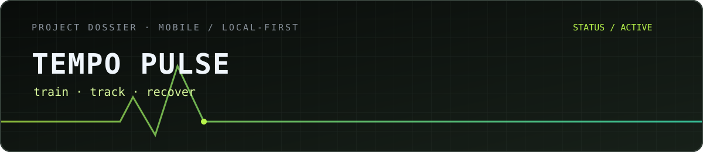
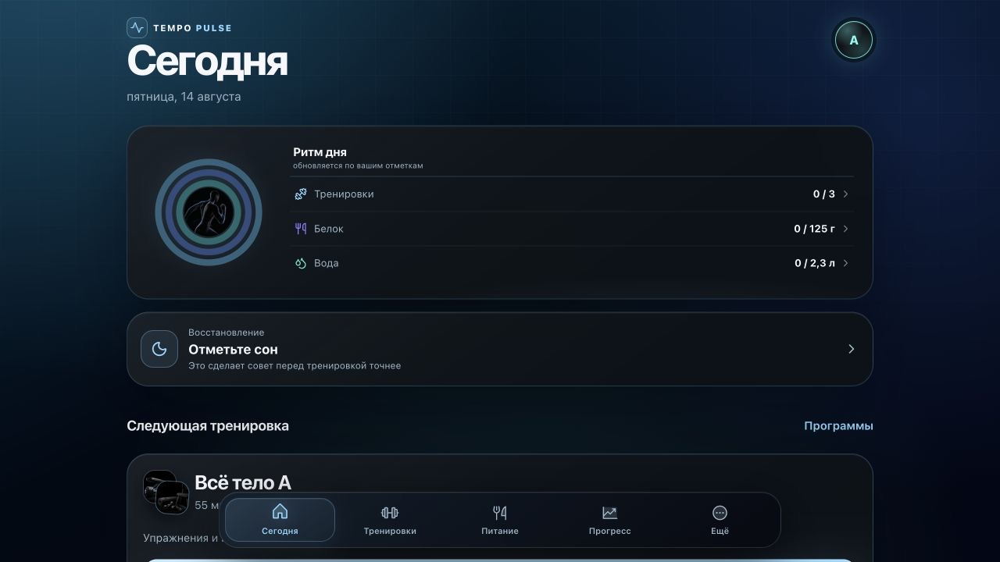
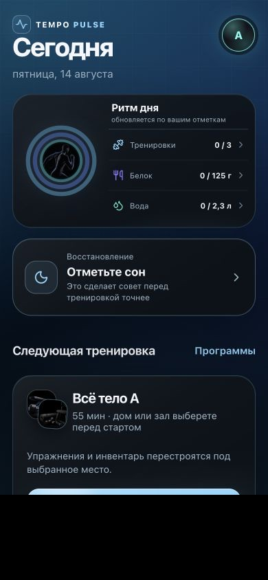
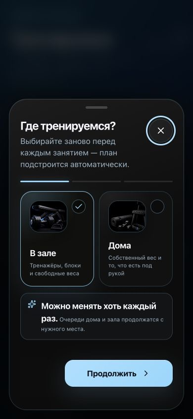

  

  <strong>Русский</strong> · <a href="./README_EN.md">English</a> · <a href="https://github.com/mrjakeball/portfolio">Все проекты</a> · <a href="https://tempo-fitness-pwa.pages.dev/">Открыть приложение ↗</a>

# TEMPO PULSE

Мобильный PWA для тренировок, питания и повседневного контроля прогресса. Основные сценарии построены вокруг локальных данных и работы без постоянного подключения к сети.

| Факт | Детали |
|---|---|
| Формат | Мобильное web-приложение / PWA |
| Статус | Активно развивается · [публичная версия](https://tempo-fitness-pwa.pages.dev/) |
| Стек | `React 19` `TypeScript` `Dexie` `WebAuthn` `PWA` |
| Исходники | Приватны; этот репозиторий содержит только витрину |

  

  
  

## Повседневный сценарий

Собрать в одном мобильном интерфейсе тренировки, питание, сон, воду и динамику прогресса — без зависимости от постоянного соединения с сервером.

## Собрано в приложении

- программы тренировок и выбор условий занятия;
- дневники питания, сна и воды;
- локальное хранение, резервные копии и восстановление данных;
- установка как PWA и адаптация под телефон.

## На чём держится

Локальная модель данных, офлайн-сценарии, вход через WebAuthn и предсказуемое восстановление пользовательского состояния.

  <a href="https://github.com/mrjakeball/portfolio">← Вернуться к списку проектов</a>

